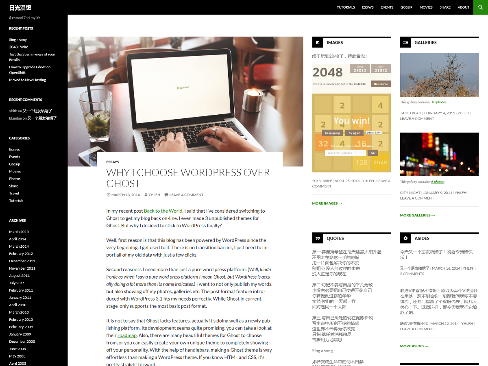

# Twenty Fourteen Full Width

A [Twenty Fourteen](https://wordpress.org/themes/twentyfourteen/) child theme that explands to full width.

Everything looks the same as Twenty Fourteen when browser window width is <= 1280px.

If browser window wider than 1280px, the main content area will expand, the sidebar will expand to 2 columns.

See screenshot below.

## How to use

1. Install this theme to your WordPress along with Twenty Fourteen.
2. Choose this theme in WordPress settings.

## License

GNU [GPL v2](LICENSE) or later.
